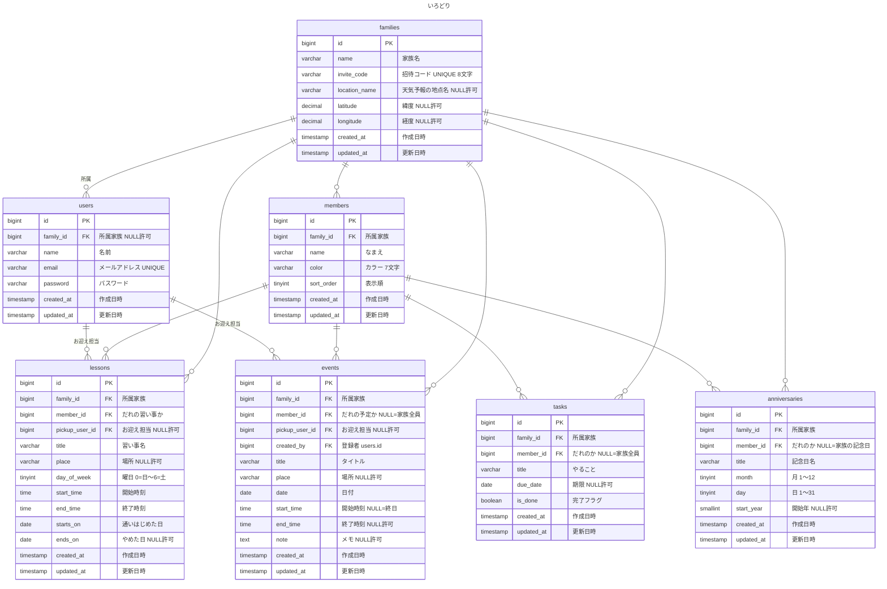

# いろどり 家族スケジュール共有アプリ

## 概要

共働き家庭の予定共有を目的とした、家族向けスケジュール管理アプリケーションです。子どもごとに色分けした「時間の帯」で1週間を可視化し、送り迎えの重なりや拘束時間をひと目で把握できる点を特徴としています。招待コードひとつで家族間のデータを共有でき、祖父母世代でも迷わない画面設計を意識しました。Laravel 10で構築し、月カレンダーには外部APIから取得した天気予報を表示します。

### 実装した主な機能

- 会員登録・ログイン・ログアウト（Laravel Fortify）
- 招待コードによる家族グループの作成・参加、グループ単位のデータ分離
- 家族メンバー（子ども）のCRUD、6色からのカラー設定
- 習い事のCRUD（曜日指定の週次くりかえし、通う期間の管理）
- 予定のCRUD（終日予定・メモ・お迎え担当の割り当て）
- 週タイムライン表示（時刻の座標変換、時間が重なる予定の自動列割り当て）
- 月カレンダー表示（表示項目の切替、メンバーによる絞り込み）
- 記念日のCRUD（年次くりかえし、年齢の自動計算、閏日対応）
- 提出物のCRUD（期限管理、完了チェック、期限順の自動ソート）
- 天気予報表示（Open-Meteo API連携、地名検索によるジオコーディング、3時間キャッシュ）
- レスポンシブ対応（PC：週表示／スマートフォン：1日表示の自動切替）

## 作成者

- 橋元　麻由

## 開発環境URL

```
http://localhost
```

## 目次

- [使用技術](#使用技術)
- [クローン後のセットアップ手順](#クローン後のセットアップ手順)
- [（参考）プロジェクトの初期構築手順](#参考プロジェクトの初期構築手順)
- [シーディングされるアカウント](#シーディングされるアカウント)
- [ER図](#er図)
- [画面一覧](#画面一覧)
- [設計上の主な判断](#設計上の主な判断)
- [今後の課題](#今後の課題)

---

## 使用技術

| 分類 | 技術 |
|---|---|
| 言語 | PHP 8.1以上（実行環境は PHP 8.5） |
| フレームワーク | Laravel 10 |
| 認証 | Laravel Fortify（会員登録・ログイン・ログアウトのみ有効） |
| データベース | MySQL 8.4 |
| 実行環境 | Laravel Sail（Docker） |
| フロントエンド | Blade + 素のCSS（CSSフレームワーク不使用） |
| 外部API連携 | Open-Meteo（天気予報・ジオコーディング／APIキー不要） |
| DB管理ツール | phpMyAdmin |
| バージョン管理 | Git / GitHub（featureブランチ＋プルリクエスト＋Squash merge） |

### CSSフレームワークを使用していない理由

本アプリの中核である週タイムラインは、時刻を座標に変換して要素を絶対配置する実装であり、フレームワークの恩恵が受けにくい箇所です。また全世代の利用を想定し、文字サイズ・タップ領域・配色を自分で制御する必要がありました。

`public/css/` に静的ファイルとして配置することで、`npm run build` のビルド工程そのものを不要にしています。

---

## クローン後のセットアップ手順

本リポジトリを `git clone` した後に必要な手順です。プロジェクトの新規作成は完了済みのため不要です。

```bash
# 1. リポジトリをクローン
git clone https://github.com/hashimo537/irodori.git

cd irodori

# 2. .envファイルを作成
cp .env.example .env
```

`.env` を開き、データベース接続情報が以下になっていることを確認してください。

```
DB_CONNECTION=mysql
DB_HOST=mysql
DB_PORT=3306
DB_DATABASE=laravel
DB_USERNAME=sail
DB_PASSWORD=password
```

**`DB_HOST` は `localhost` ではなく、Dockerコンテナ名の `mysql` です。**

天気予報は Open-Meteo を利用しており、**APIキーの設定は不要**です。

```bash
# 3. Composerの依存パッケージをインストール
#    （ローカルにPHP/Composerが無い場合はDockerイメージ経由）
docker run --rm \
    -u "$(id -u):$(id -g)" \
    -v "$(pwd):/var/www/html" \
    -w /var/www/html \
    laravelsail/php82-composer:latest \
    composer install --ignore-platform-reqs

# 4. Sailを起動
./vendor/bin/sail up -d

# 5. アプリケーションキーを生成
sail artisan key:generate

# 6. マイグレーション＋シーディング
sail artisan migrate --seed
```

> **エイリアスの設定（推奨）**
>
> 毎回 `./vendor/bin/sail` と入力するのは手間なので、エイリアスを設定すると便利です。
>
> ```bash
> alias sail='[ -f sail ] && bash sail || bash vendor/bin/sail'
> ```

`http://localhost` にアクセスして動作確認してください。**フロントエンドのビルドは不要です。**

### 天気予報の動作確認

天気予報は、家族ごとに地点を設定してから表示されます。

1. ログイン後、`/month`（月カレンダー）を開く
2. 画面下部の「地域を設定する」から、市区町村名（例：横浜市）で検索
3. 候補から選択すると、今日から16日先までの天気が月カレンダーに表示されます

地点が未設定の場合は外部APIへの通信を行わず、天気欄は空のままになります。

---

## （参考）プロジェクトの初期構築手順

> 本プロジェクトを最初から作った際の手順です。環境の再現性を確認したい場合の参考としてください。

### 1. Laravelプロジェクトの作成（Laravel 10.x）

`laravel.build` は常に最新版を取得してしまうため使用しません。バージョンを明示して作成します。

```bash
docker run --rm -u "$(id -u):$(id -g)" -v "$(pwd):/var/www/html" -w /var/www/html \
    -e COMPOSER_CACHE_DIR=/tmp/composer_cache \
    laravelsail/php82-composer:latest \
    composer create-project laravel/laravel:^10.0 irodori
```

### 2. Laravel Sailのインストール

```bash
cd irodori

docker run --rm -u "$(id -u):$(id -g)" -v "$(pwd):/var/www/html" -w /var/www/html \
    -e COMPOSER_CACHE_DIR=/tmp/composer_cache \
    laravelsail/php82-composer:latest \
    composer require laravel/sail --dev

docker run --rm -u "$(id -u):$(id -g)" -v "$(pwd):/var/www/html" -w /var/www/html \
    laravelsail/php82-composer:latest \
    php artisan sail:install --with=mysql
```

### 3. phpMyAdminの追加

`compose.yaml` の `mysql` サービスの後に追加します。

```yaml
    phpmyadmin:
        image: 'phpmyadmin:latest'
        ports:
            - '${FORWARD_PHPMYADMIN_PORT:-8080}:80'
        environment:
            PMA_HOST: mysql
            PMA_USER: '${DB_USERNAME}'
            PMA_PASSWORD: '${DB_PASSWORD}'
        networks:
            - sail
        depends_on:
            - mysql
```

### 4. 起動と初期化

```bash
./vendor/bin/sail up -d
sail artisan key:generate
```

### 5. 日本語化

`config/app.php` の `locale` を `ja` に変更し、`app/Providers/AppServiceProvider.php` の `boot()` に1行追加します。

```php
\Carbon\Carbon::setLocale('ja');
```

バリデーションと認証のメッセージは `lang/ja/` に手動で配置しています。

> **`laravel-lang/*` 系パッケージは使用していません。** 同系パッケージは2026年5月のサプライチェーン攻撃でマルウェア配布に悪用された経緯があるため、意図的に避けています。

### 6. Fortifyの導入

```bash
sail composer require laravel/fortify
sail artisan vendor:publish --provider='Laravel\Fortify\FortifyServiceProvider'
```

`config/app.php` の `providers` に `App\Providers\FortifyServiceProvider::class` を追加し、`config/fortify.php` の `features` を `Features::registration()` のみに絞っています。

**有効にした機能には画面を用意する義務が生じる**ため、使用しない機能（パスワード再設定・2要素認証など）は最初から無効化しています。

### 7. マイグレーションと初期データ投入

```bash
sail artisan migrate --seed
```

データベースをリセットしたい場合：

```bash
sail artisan migrate:fresh --seed
```

---

## シーディングされるアカウント

`sail artisan migrate --seed` 実行後、以下のユーザーが登録されます。

| 名前 | メールアドレス | パスワード |
|---|---|---|
| まゆ | demo@example.com | password |

デモデータとして、子ども3名（はると・ゆい・あおい）、習い事11件、単発の予定2件、提出物3件、記念日3件が「はしもと家」に登録されます。

シーディング実行時、コンソールに**招待コード**が表示されます。別のアカウントを新規登録し、このコードで参加すると、2人が同じ予定を閲覧できることを確認できます（ブラウザのシークレットウィンドウを使用してください）。

```
デモデータを作りました。 招待コード: XXXXXXXX
ログイン: demo@example.com / password
```

習い事のデータには、**土曜午前に時間が重なる2件（サッカー 9:00-11:00／絵画 10:00-11:30）**を意図的に含めています。週タイムラインでこの2件が左右に分割表示されることで、重複予定の列割り当て処理を確認できます。

---

## ER図



### 補足

- 中間テーブルは存在せず、すべて1対多のリレーションで構成しています（後述）
- `families` 削除時、`members`・`lessons`・`events`・`tasks`・`anniversaries` は `cascadeOnDelete`
- `families` 削除時、`users.family_id` は `nullOnDelete`（ユーザー自体は残す）
- `members` 削除時、`lessons` は `cascadeOnDelete`、`events`・`tasks`・`anniversaries` は `nullOnDelete`（家族全員の予定として残す）
- `events` には `['family_id', 'date']` の複合インデックスを設定（週単位の絞り込みを高速化）

---

## 画面一覧

| 画面 | パス | 認証 |
|---|---|---|
| トップ | `/` | 不要（ログイン済みは `/home` へ転送） |
| 会員登録・ログイン | `/register` `/login` | Fortify提供 |
| 家族の作成・招待コードで参加 | `/family/setup` | 必須（家族未所属時のみ） |
| 週タイムライン（ホーム） | `/home` | 必須＋家族所属 |
| 月カレンダー | `/month` | 必須＋家族所属 |
| 招待コード表示 | `/family/invite` | 必須＋家族所属 |
| 地域の設定（天気予報） | `/family/settings` | 必須＋家族所属 |
| 家族メンバー一覧・編集 | `/members` `/members/{member}/edit` | 必須＋家族所属 |
| 習い事一覧・登録・編集 | `/lessons` 他 | 必須＋家族所属 |
| 予定の登録・編集 | `/events/create` `/events/{event}/edit` | 必須＋家族所属 |
| 提出物一覧 | `/tasks` | 必須＋家族所属 |
| 記念日一覧・編集 | `/anniversaries` 他 | 必須＋家族所属 |

ルートは `auth` ミドルウェアの内側に `has.family` ミドルウェアを入れ子にしています。家族作成の3ルートのみ `auth` 直下に置くことで、家族未所属のユーザーが家族作成画面へ到達できない**無限リダイレクトを回避**しています。

---

## 設計上の主な判断

### 1. くりかえし予定を展開せず、表示時に組み立てる

習い事は「毎週同じ曜日」に限定し、DBには**曜日・開始/終了時刻・通う期間の1レコードのみ**を保持しています。表示時に対象週へ展開するため、展開結果の保存や整合性の維持が不要です。

`starts_on` / `ends_on` で期間を持つことにより、やめた習い事も過去の週には正しく表示されます。

同じ考え方を記念日にも適用し、日付ではなく**月と日のみ**を保持することで、毎年のくりかえしを実現しています（閏日は平年2月28日に表示）。

### 2. グローバルスコープによるデータ分離

家族単位のデータ分離を、各クエリへの条件記述ではなく**Eloquentのグローバルスコープ**で実装しました。トレイトとして定義し、対象5モデルに適用しています。

```php
// app/Models/Concerns/BelongsToFamily.php
static::addGlobalScope('family', function (Builder $query) {
    if (auth()->check() && auth()->user()->family_id) {
        $query->where($query->getModel()->getTable() . '.family_id', auth()->user()->family_id);
    }
});
```

全クエリに所属家族の条件が自動付与され、ルートモデルバインディング経由の取得・更新・削除にも適用されます。条件の記述漏れによる情報漏洩を構造的に防いでいます。

加えて `users.$fillable` から `family_id` を除外し、家族への参加は `forceFill()` 経由のみに限定することで、登録フォームからのマスアサインメントを防いでいます。

### 3. 時間が重なる予定の列割り当て

週タイムラインは **1分 = 1px** で時刻を座標に変換し、絶対配置で帯を描画しています。

時間が重なる予定については、区間スケジューリングの考え方で2段階に処理しています。

1. 時間が連続する予定を「塊」に分割する
2. 塊の中で、各予定を空いている列に順次割り当てる

塊ごとに列数が決まるため、**重なっていない予定は全幅を保ちます**。一律に分割しないことで、予定が1件の日まで狭くなることを避けています。

### 4. 外部API連携は「失敗する前提」で設計

天気予報は補助的な機能であり、外部APIの障害がアプリ全体を停止させてはならないと判断しました。

- 通信処理をサービスクラス（`app/Services/WeatherService.php`）に分離し、依存性注入で利用
- タイムアウト5秒を設定（未設定の場合、応答待ちでプロセスが占有され続けるため）
- 例外を捕捉し、失敗時は空配列を返して画面を維持（ログには警告を記録）
- 3時間のキャッシュを設定し、通信回数を削減

APIのURLを意図的に不正な値に変更し、カレンダーが正常に表示されることとログに記録されることを確認しています。

なお**日別の天気予報は気象学的に2週間程度が限界**であり、当初想定していた「1ヶ月分の表示」は実現不可能と判断しました。16日分を表示し、以降は空欄とする仕様に変更しています。

### 5. 多対多を使用していない理由

本アプリのリレーションはすべて1対多で表現できるため、中間テーブルは作成していません。「1つの予定に複数の子どもが参加する」といった要件が生じた時点で、初めてピボットテーブルが必要になる設計です。

### 6. 全世代を想定した画面設計

祖父母世代の利用を想定し、以下を全画面で統一しています。

- 本文16px以上、タップ領域は高さ48px以上
- **色だけで意味を伝えない**（帯には必ず子どもの名前を併記）
- アイコン単体を使わず、必ず文字ラベルを添える
- 影を使わず、罫線と余白で領域を区切る

予定の帯は「薄い背景色＋左端4pxの濃い色線」で描画しています。濃い色でベタ塗りすると、6色の明度差により配色ごとに文字の可読性が変わってしまうためです。この方式では文字色が常に一定となり、**どの色を選んでも読みやすさが変わりません**。

終日の予定は色を変えるのではなく「枠線で囲む」ことで区別しており、色に依存しない見分け方を採用しています。

---

## 今後の課題

本プロジェクトでは以下は未実装です。手動での動作確認にとどまっています。

| 項目 | 内容 |
|---|---|
| 自動テスト | PHPUnitによる単体・機能テストは未実装。特にデータ分離の検証は自動化すべき箇所 |
| 認可（Policy） | 現状はグローバルスコープによる分離のみ。家族内での権限分けは未対応 |
| バッチ処理 | 提出物の期限リマインダー通知などは未実装 |


### 既知の仕様上の制約

- 習い事のお迎え担当は固定です。「今週だけ担当を変更」には対応していません（対応するには例外テーブルの追加が必要）
- くりかえしは「毎週」のみ対応です。「隔週」「毎月第2火曜」などには対応していません
- 1ユーザーは1つの家族にのみ所属できます
